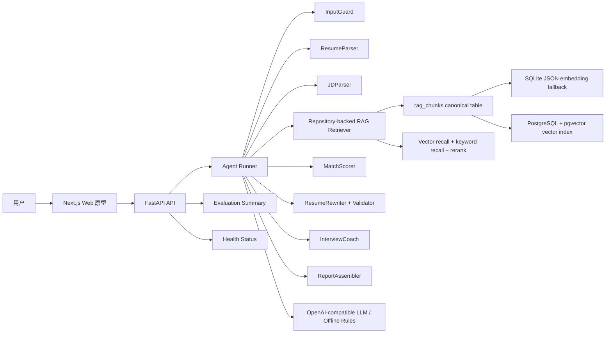
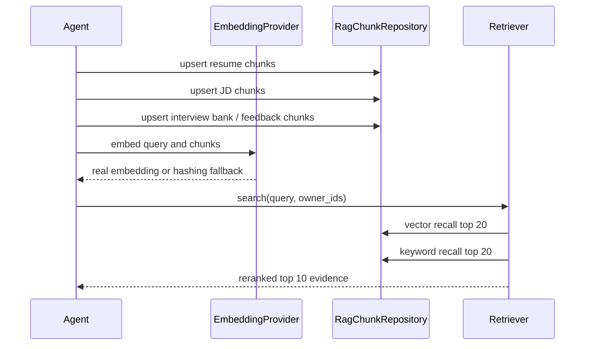

# 系统架构与技术栈

## 1. 总体架构

v4 的核心变化是把演示型 RAG 升级为 repository-backed RAG：Agent 在解析简历/JD 后先写入统一 `rag_chunks`，再从数据库检索证据。默认使用 SQLite + JSON embedding，配置 `VECTOR_BACKEND=pgvector` 后切到 PostgreSQL + pgvector。v4.1 进一步将 LLM Provider 和 Embedding Provider 解耦，聊天模型和向量模型可以分别配置。

## 2. Agent 节点

- InputGuard：检查输入长度、隐私提示和基础格式。
- ResumeParser：解析简历结构，抽取教育、技能、项目、经历。
- JDParser：解析岗位名称、职责、技能要求、关键词。
- RAGRetriever：写入当前简历/JD chunk，加载面试题库和反馈记录，再召回证据。
- MatchScorer：计算加权评分并生成优势、短板和风险。
- ResumeRewriter：基于证据生成 before/after 建议。
- EvidenceValidator：检查建议是否缺少 evidence_id、疑似虚构公司、指标或技能。
- InterviewCoach：生成面试题并评价回答。
- FeedbackUpdater：记录用户采纳、拒绝和修改意见。
- ReportAssembler：组装报告、保存 trace、写入历史记录。

## 3. RAG 链路

召回策略：

- 向量召回 top 20：pgvector 下使用 cosine 距离，SQLite 下读取 JSON embedding 后在 Python 中计算 cosine。
- 关键词召回 top 20：使用 token overlap 作为稳定兜底。
- Python rerank：合并去重后重新排序，最终返回 top 10 evidence。
- `retrieval_method` 标记为 `hybrid-pgvector`、`vector-pgvector`、`hybrid-sqlite`、`keyword` 或 `fallback`。
- Embedding API 失败时自动使用 hashing fallback，并累计 `embedding_fallback_count`。
- 更换 embedding 模型或维度后，通过 `POST /rag/reindex` 重建已有 `rag_chunks.embedding`。

## 4. 技术栈选择

- 前端：Next.js + TypeScript + Tailwind CSS。适合快速构建交互式原型，便于展示匹配报告、diff、Agent Trace 和 RAG 状态。
- 后端：FastAPI + Pydantic。接口声明清晰，自动生成 OpenAPI，适合 AI 应用服务。
- 数据层：SQLAlchemy + SQLite fallback；正式向量检索可配置 PostgreSQL + pgvector。
- Agent：当前使用可追踪顺序 runner，节点输入、输出、耗时和错误可展示；后续可替换为 LangGraph。
- 模型：默认 OfflineProvider；配置 `LLM_PROVIDER=openai` 后切换 OpenAI-compatible Provider。
- Embedding：通过 `EMBEDDING_PROVIDER` 独立配置，支持 `offline`、`openai`、`openai_compatible`、`local`；本地默认加载 `backend/models/bge-small-zh-v1.5`，失败时使用 hashing fallback。

## 5. 核心 API

- `GET /health`
- `POST /resumes/upload`
- `POST /resumes/parse`
- `POST /jobs/analyze`
- `POST /matches`
- `POST /matches/batch`
- `POST /resumes/{resume_id}/rewrite`
- `POST /interviews/sessions`
- `POST /interviews/{session_id}/answer`
- `POST /feedback`
- `GET /reports/{report_id}`
- `GET /reports`
- `POST /resume-versions`
- `GET /resume-versions/{resume_id}`
- `GET /resume-versions/export/{version_id}`
- `GET /evaluation/summary`
- `POST /rag/reindex`

`GET /health` 在 v4 扩展为返回：

- `mode`
- `vector_backend`
- `embedding_provider`
- `embedding_fallback_count`
- `embedding_configured_provider`
- `embedding_model`
- `embedding_dimension`
- `embedding_real_enabled`
- `embedding_last_error`

接口不会暴露 API Key 或完整数据库 URL。

## 6. 数据模型

- `resumes`：原始简历与解析结果。
- `resume_chunks`：旧版简历切片表，保留兼容。
- `job_descriptions`：原始 JD 与解析结果。
- `jd_chunks`：旧版 JD 切片表，保留兼容。
- `rag_chunks`：v4 统一 RAG chunk 表，覆盖简历、JD、面试题库和反馈记录。
- `match_reports`：匹配评分、证据、建议、问题和 Agent trace。
- `resume_versions`：简历改写版本、diff 和 Markdown 导出内容。
- `interview_sessions`：面试题和回答记录。
- `feedback_events`：用户反馈闭环。

`rag_chunks` 字段：

- `id`
- `owner_id`
- `source`
- `title`
- `text`
- `embedding`
- `metadata_json`
- `created_at`

SQLite 下 `embedding` 存 JSON；PostgreSQL 下启用 pgvector 后使用 `vector(EMBEDDING_DIMENSION)`。

## 7. v4 已落地能力

- 新增 `psycopg[binary]` 和 `pgvector` 依赖。
- 新增 `VECTOR_BACKEND`、`DATABASE_URL`、`EMBEDDING_PROVIDER`、`EMBEDDING_BASE_URL`、`EMBEDDING_API_KEY`、`EMBEDDING_MODEL`、`EMBEDDING_DIMENSION`、`PGVECTOR_TEST_DATABASE_URL` 配置。
- 新增 `backend/.env.example`，只保留占位符。
- 新增 `docker-compose.pgvector.yml`，作为可选 pgvector 启动方式。
- 启动时在 pgvector 模式下尝试创建 extension、向量列和 HNSW 索引。
- `_retrieve_node` 在检索前 upsert 当前简历/JD、静态面试题库和反馈 chunk。
- repository retriever 优先走数据库检索，失败时回到内存检索。
- 评测摘要增加 `validation_pass_rate`、`embedding_fallback_count`、`rag_backend`。
- 前端项目展示页展示真实 RAG 链路状态和 evidence 召回方式。
- 新增 RAG reindex 能力，用于 embedding provider 或向量维度切换后的数据重建。

## 8. 后续演进

- 将顺序 runner 替换为 LangGraph，持久化节点状态、错误信息和人工反馈节点。
- 增加更精细的 reranker，例如 cross-encoder 或 LLM rerank，但保留可解释分数。
- 扩展评测样例到 30-50 组，输出 Prompt、RAG、评分策略变更前后的质量对比。
- 将评测结果导出为 Markdown/HTML，用于项目答辩和简历投递展示。
